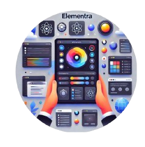

# 🎨 Elementra UI - Modern React Component Library

<div align="center">
  
  
  <h3>Build Beautiful UIs Fast</h3>
  <p>A comprehensive React component library with 50+ components for modern web applications</p>

  [](https://www.npmjs.com/package/elementra-ui)
  [](https://www.npmjs.com/package/elementra-ui)
  [](./LICENSE)
  [](https://github.com/waleedcodes/Elementra-Dev)

</div>
    <a href="https://opensource.org/licenses/MIT">
      
    </a>
    <a href="https://www.npmjs.com/package/elementra-ui">
      
    </a>
    <a href="https://github.com/elementra-ui/elementra-ui">
      
    </a>
  </p>
  
  <p>
    <a href="https://elementra-ui.vercel.app/docs/">📚 Documentation</a> •
    <a href="https://github.com/elementra-ui/discussions">💬 Discussions</a> •
    <a href="https://youtube.com/@waleedcodes">📺 YouTube</a> •
    <a href="https://twitter.com/waleedcodes">🐦 Twitter</a>
  </p>
</div>

---

## Overview

Elementra UI is a comprehensive React component library designed for modern web applications. Built with accessibility, performance, and developer experience in mind, it provides a complete toolkit for creating beautiful and functional user interfaces with minimal setup.

### Why Elementra UI?

- **Developer-First Experience**: Intuitive CLI tools and comprehensive documentation
- **Production-Ready**: Battle-tested components used in real-world applications
- **Accessibility-Focused**: WCAG 2.1 compliant with full keyboard navigation support
- **Highly Customizable**: Tailwind CSS integration with theme system
- **Type-Safe**: Full TypeScript support with detailed prop definitions
- **Zero Configuration**: Works out-of-the-box with sensible defaults

---

## Key Features

### 🎨 **Modern Design System**

- Clean, contemporary aesthetics built with Tailwind CSS
- Consistent design tokens and spacing system
- Dark mode support with seamless theme switching
- Customizable color palettes and typography scales

### ♿ **Accessibility First**

- Full WAI-ARIA compliance
- Comprehensive keyboard navigation
- Screen reader optimization
- Focus management and high contrast support

### ⚡ **Developer Experience**

- One-command component installation via CLI
- Comprehensive TypeScript definitions
- Extensive documentation with live examples
- Jest testing utilities included

### 🏗️ **Architecture**

- Headless component patterns for maximum flexibility
- Composable API design
- Tree-shakeable imports for optimal bundle size
- Framework-agnostic core with React bindings

---

## Installation

### Package Installation

```bash
# Using npm
npm install elementra-ui

# Using yarn
yarn add elementra-ui

# Using pnpm
pnpm add elementra-ui
```

### Required Dependencies

```bash
npm install clsx tailwind-merge tailwindcss-animate
```

### Tailwind CSS Configuration

Add the following to your `tailwind.config.js`:

```javascript
/** @type {import('tailwindcss').Config} */
module.exports = {
  content: [
    "./src/**/*.{js,jsx,ts,tsx}",
    "./node_modules/elementra-ui/**/*.{js,jsx,ts,tsx}",
  ],
  theme: {
    extend: {
      // Your custom theme extensions
    },
  },
  plugins: [require("tailwindcss-animate")],
};
```

---

## Quick Start

### Using the CLI

The fastest way to add components to your project:

```bash
# Interactive component selection
npx elementra-ui add

# Add specific components
npx elementra-ui add button input dialog

# Add all components
npx elementra-ui add --all
```

The CLI automatically:

- Installs components to `src/components/ui/`
- Creates necessary utility files
- Handles dependency management
- Updates your project configuration

### Manual Usage

```jsx
import { Button } from "@/components/ui/button";
import { Input } from "@/components/ui/input";
import { Dialog } from "@/components/ui/dialog";

export default function App() {
  return (
    <div className="p-6 space-y-4">
      <Input placeholder="Enter your email" type="email" />
      <Button variant="default" size="lg">
        Get Started
      </Button>
    </div>
  );
}
```

---

## Component Catalog

### Form Components

| Component    | Description                       | Key Features                              |
| ------------ | --------------------------------- | ----------------------------------------- |
| **Input**    | Text input with validation states | Password toggle, icons, character counter |
| **Textarea** | Multi-line text input             | Auto-resize, character limits             |
| **Select**   | Dropdown selection                | Search, multi-select, custom rendering    |
| **Checkbox** | Boolean input control             | Indeterminate state, custom icons         |
| **Radio**    | Single choice selection           | Grouped controls, custom styling          |
| **Switch**   | Toggle control                    | Smooth animations, accessibility          |
| **Slider**   | Range input control               | Dual handles, step controls, tooltips     |

### Navigation Components

| Component           | Description                 | Key Features                                |
| ------------------- | --------------------------- | ------------------------------------------- |
| **Navigation Menu** | Primary site navigation     | Responsive, dropdown support, active states |
| **Breadcrumb**      | Hierarchical navigation     | Separator customization, overflow handling  |
| **Tabs**            | Content organization        | Keyboard navigation, lazy loading           |
| **Sidebar**         | Collapsible side navigation | Responsive, overlay mode, icons             |

### Feedback Components

| Component    | Description               | Key Features                              |
| ------------ | ------------------------- | ----------------------------------------- |
| **Alert**    | Status messages           | Multiple variants, dismissible, icons     |
| **Badge**    | Status indicators         | Dot variant, custom colors, positioning   |
| **Progress** | Task completion indicator | Determinate/indeterminate, custom styling |
| **Toast**    | Temporary notifications   | Queue management, positioning, actions    |
| **Skeleton** | Loading placeholders      | Animated, customizable shapes             |

### Overlay Components

| Component         | Description         | Key Features                              |
| ----------------- | ------------------- | ----------------------------------------- |
| **Dialog**        | Modal dialogs       | Focus trapping, backdrop, animations      |
| **Sheet**         | Slide-in panels     | Multiple directions, responsive           |
| **Popover**       | Floating content    | Positioning, arrow, click outside         |
| **Tooltip**       | Contextual help     | Delay controls, positioning, rich content |
| **Dropdown Menu** | Action menus        | Keyboard navigation, submenus, separators |
| **Context Menu**  | Right-click menus   | Platform-aware, nested items              |
| **Hover Card**    | Rich hover previews | Delay controls, positioning               |

### Data Components

| Component      | Description          | Key Features                                  |
| -------------- | -------------------- | --------------------------------------------- |
| **Data Table** | Sortable data tables | Pagination, filtering, row selection          |
| **Calendar**   | Date selection       | Range selection, disabled dates, localization |
| **Command**    | Command palette      | Fuzzy search, keyboard shortcuts, grouping    |
| **Avatar**     | User representations | Fallback handling, status indicators, groups  |

### Layout Components

| Component     | Description          | Key Features                            |
| ------------- | -------------------- | --------------------------------------- |
| **Card**      | Content containers   | Headers, footers, interactive states    |
| **Separator** | Visual dividers      | Horizontal/vertical, custom styling     |
| **Resizable** | Adjustable panels    | Constraints, persistence, touch support |
| **Accordion** | Collapsible sections | Multiple/single expansion, animations   |

### Specialized Components

| Component                     | Description               | Key Features                          |
| ----------------------------- | ------------------------- | ------------------------------------- |
| **Fancy Testimonials Slider** | Testimonial carousel      | Auto-play, responsive, touch gestures |
| **Scratch to Reveal**         | Interactive reveal effect | Customizable scratch area, callbacks  |
| **React Signature**           | Digital signature capture | Touch/mouse support, export options   |

---

## Usage Examples

### Form Handling

```jsx
import { useState } from "react";
import { Input } from "@/components/ui/input";
import { Button } from "@/components/ui/button";
import { Label } from "@/components/ui/label";
import { Alert } from "@/components/ui/alert";

function LoginForm() {
  const [email, setEmail] = useState("");
  const [password, setPassword] = useState("");
  const [error, setError] = useState("");

  const handleSubmit = async (e) => {
    e.preventDefault();
    try {
      // Handle login
    } catch (err) {
      setError("Invalid credentials");
    }
  };

  return (
    <form onSubmit={handleSubmit} className="space-y-4 max-w-md">
      {error && <Alert intent="error">{error}</Alert>}

      <div className="space-y-2">
        <Label htmlFor="email">Email</Label>
        <Input
          id="email"
          type="email"
          placeholder="Enter your email"
          value={email}
          onChange={(e) => setEmail(e.target.value)}
          required
        />
      </div>

      <div className="space-y-2">
        <Label htmlFor="password">Password</Label>
        <Input
          id="password"
          type="password"
          placeholder="Enter your password"
          value={password}
          onChange={(e) => setPassword(e.target.value)}
          required
        />
      </div>

      <Button type="submit" className="w-full">
        Sign In
      </Button>
    </form>
  );
}
```

### Data Display

```jsx
import { DataTable } from "@/components/ui/data-table";
import { Badge } from "@/components/ui/badge";
import { Avatar } from "@/components/ui/avatar";

function UserTable({ users }) {
  const columns = [
    {
      key: "avatar",
      title: "",
      render: (_, user) => (
        <Avatar src={user.avatar} alt={user.name} size="sm" />
      ),
    },
    {
      key: "name",
      title: "Name",
      sortable: true,
    },
    {
      key: "email",
      title: "Email",
      sortable: true,
    },
    {
      key: "status",
      title: "Status",
      render: (status) => (
        <Badge variant={status === "active" ? "success" : "secondary"}>
          {status}
        </Badge>
      ),
    },
  ];

  return (
    <DataTable
      data={users}
      columns={columns}
      pageSize={10}
      sortable
      searchable
    />
  );
}
```

### Complex Dialogs

```jsx
import {
  Dialog,
  DialogTrigger,
  DialogContent,
  DialogHeader,
  DialogTitle,
  DialogDescription,
  DialogFooter,
  DialogClose,
} from "@/components/ui/dialog";
import { Button } from "@/components/ui/button";
import { Input } from "@/components/ui/input";
import { Label } from "@/components/ui/label";

function CreateProjectDialog() {
  return (
    <Dialog>
      <DialogTrigger asChild>
        <Button>Create Project</Button>
      </DialogTrigger>

      <DialogContent className="sm:max-w-md">
        <DialogHeader>
          <DialogTitle>Create New Project</DialogTitle>
          <DialogDescription>
            Enter the details for your new project. You can change these later.
          </DialogDescription>
        </DialogHeader>

        <div className="space-y-4 py-4">
          <div className="space-y-2">
            <Label htmlFor="project-name">Project Name</Label>
            <Input id="project-name" placeholder="My Awesome Project" />
          </div>

          <div className="space-y-2">
            <Label htmlFor="project-desc">Description</Label>
            <Input id="project-desc" placeholder="A brief description..." />
          </div>
        </div>

        <DialogFooter>
          <DialogClose asChild>
            <Button variant="outline">Cancel</Button>
          </DialogClose>
          <Button>Create Project</Button>
        </DialogFooter>
      </DialogContent>
    </Dialog>
  );
}
```

---

## API Reference

### Common Props

All components support these common props:

| Prop        | Type        | Description               |
| ----------- | ----------- | ------------------------- |
| `className` | `string`    | Additional CSS classes    |
| `children`  | `ReactNode` | Child elements            |
| `asChild`   | `boolean`   | Render as child component |

### Component-Specific APIs

#### Input Component

```typescript
interface InputProps {
  type?: "text" | "email" | "password" | "number" | "search" | "url";
  size?: "sm" | "md" | "lg";
  intent?: "default" | "success" | "error";
  disabled?: boolean;
  leftIcon?: ReactNode;
  rightIcon?: ReactNode;
  showPasswordToggle?: boolean;
  maxLength?: number;
}
```

#### Button Component

```typescript
interface ButtonProps {
  variant?:
    | "default"
    | "destructive"
    | "outline"
    | "secondary"
    | "ghost"
    | "link";
  size?: "sm" | "md" | "lg" | "icon";
  loading?: boolean;
  disabled?: boolean;
}
```

#### Dialog Component

```typescript
interface DialogProps {
  open?: boolean;
  onOpenChange?: (open: boolean) => void;
  modal?: boolean;
}
```

_For complete API documentation, visit our [documentation site](https://elementra-ui.vercel.app/docs/)._

---

## Testing

Elementra UI includes comprehensive testing utilities:

```javascript
// jest.config.js
module.exports = {
  testEnvironment: "jsdom",
  setupFilesAfterEnv: ["<rootDir>/src/setupTests.js"],
  moduleNameMapping: {
    "^@/(.*)$": "<rootDir>/src/$1",
  },
};
```

Example component test:

```jsx
import { render, screen, fireEvent } from "@testing-library/react";
import { Button } from "@/components/ui/button";

describe("Button", () => {
  it("renders with correct text", () => {
    render(<Button>Click me</Button>);
    expect(screen.getByText("Click me")).toBeInTheDocument();
  });

  it("handles click events", () => {
    const handleClick = jest.fn();
    render(<Button onClick={handleClick}>Click me</Button>);

    fireEvent.click(screen.getByText("Click me"));
    expect(handleClick).toHaveBeenCalledTimes(1);
  });
});
```

---

## Customization

### Theme Configuration

Create a custom theme by extending the default configuration:

```javascript
// tailwind.config.js
module.exports = {
  theme: {
    extend: {
      colors: {
        primary: {
          50: "#eff6ff",
          500: "#3b82f6",
          900: "#1e3a8a",
        },
      },
      fontFamily: {
        sans: ["Inter", "system-ui", "sans-serif"],
      },
    },
  },
};
```

### CSS Variables

Elementra UI uses CSS variables for easy theming:

```css
:root {
  --primary: 222.2 84% 4.9%;
  --primary-foreground: 210 40% 98%;
  --secondary: 210 40% 96%;
  --secondary-foreground: 222.2 84% 4.9%;
  --muted: 210 40% 96%;
  --muted-foreground: 215.4 16.3% 46.9%;
  --border: 214.3 31.8% 91.4%;
  --radius: 0.5rem;
}
```

---

## Migration Guide

### From v0.4.x to v0.5.x

- **Breaking**: `NavigationMenu` API has changed
- **New**: Added `Sidebar`, `Toggle`, and `Resizable` components
- **Improved**: Better TypeScript definitions

```jsx
// Before (v0.4.x)
<NavigationMenu items={menuItems} />

// After (v0.5.x)
<NavigationMenu>
  <NavigationMenuList>
    {menuItems.map(item => (
      <NavigationMenuItem key={item.id}>
        <NavigationMenuLink href={item.href}>
          {item.label}
        </NavigationMenuLink>
      </NavigationMenuItem>
    ))}
  </NavigationMenuList>
</NavigationMenu>
```

---

## Contributing

We welcome contributions from the community! Here's how to get started:

### Development Setup

```bash
# Clone the repository
git clone https://github.com/elementra-ui/elementra-ui.git
cd elementra-ui

# Install dependencies
npm install

# Start development server
npm run dev

# Run tests
npm test

# Build for production
npm run build
```

### Contribution Guidelines

1. **Code Style**: Follow our ESLint and Prettier configurations
2. **Testing**: Add unit tests for new components
3. **Documentation**: Update README and component docs
4. **Accessibility**: Ensure WCAG 2.1 compliance
5. **TypeScript**: Provide complete type definitions

### Submitting Changes

1. Fork the repository
2. Create a feature branch (`git checkout -b feature/amazing-feature`)
3. Commit your changes (`git commit -m 'Add amazing feature'`)
4. Push to the branch (`git push origin feature/amazing-feature`)
5. Open a Pull Request

---

## Community & Support

### Getting Help

- **Documentation**: [https://elementra-ui.vercel.app/docs/](https://elementra-ui.vercel.app/docs/)
- **GitHub Issues**: Report bugs and request features
- **Discussions**: Community support and questions
- **Discord**: Real-time chat with maintainers and users

### Showcase

Built something amazing with Elementra UI? We'd love to feature it! Share your projects in our [Showcase Discussion](https://github.com/elementra-ui/discussions/categories/showcase).

---

## Roadmap

### Upcoming Features (v0.6.0)

- **Form Builder**: Drag-and-drop form construction
- **Chart Components**: Data visualization library
- **Advanced Tables**: Virtual scrolling, column resizing
- **Theme Designer**: Visual theme customization tool
- **Storybook Integration**: Interactive component playground

### Long-term Goals

- **Framework Adapters**: Vue.js and Svelte support
- **Mobile Components**: React Native compatibility
- **Enterprise Features**: Advanced data grid, workflow builder
- **Design System Tools**: Token management, design-dev sync

---

## Performance

Elementra UI is optimized for performance:

- **Tree Shaking**: Import only what you use
- **Code Splitting**: Async component loading
- **Bundle Size**: < 50KB for core components
- **Runtime**: Zero runtime dependencies for styling
- **SSR**: Full server-side rendering support

---

## Browser Support

| Browser | Version |
| ------- | ------- |
| Chrome  | ≥ 90    |
| Firefox | ≥ 88    |
| Safari  | ≥ 14    |
| Edge    | ≥ 90    |

---

## License

MIT © 2025 Elementra UI

Permission is hereby granted, free of charge, to any person obtaining a copy of this software and associated documentation files (the "Software"), to deal in the Software without restriction, including without limitation the rights to use, copy, modify, merge, publish, distribute, sublicense, and/or sell copies of the Software.

---

## Acknowledgments

Special thanks to:

- **Radix UI** - For headless component primitives
- **Tailwind CSS** - For the utility-first CSS framework
- **React Community** - For continuous inspiration and feedback
- **Contributors** - Everyone who has helped improve this library

---

<div align="center">
  <p>Made with ❤️ by the @waleedcodes</p>
  <p>
    <a href="https://github.com/elementra-ui/elementra-ui">⭐ Star us on GitHub</a> •
    <a href="https://twitter.com/waleedcodes">🐦 Follow updates</a> •
    <a href="https://elementra-ui.vercel.app">🌐 Visit our website</a>
  </p>
</div>
